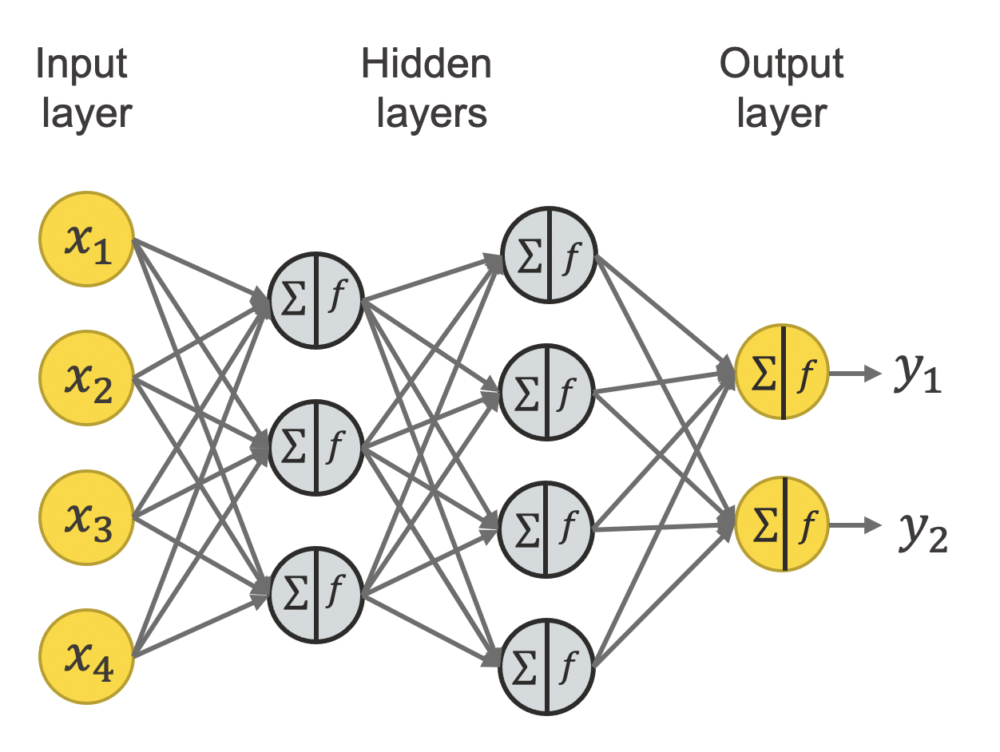

# Machine Learning from Scratch

A collection of machine learning algorithms written from scratch including linear regression, logistic regression, linear discriminant analysis, decision trees, and neural nets. Built with Python. 
 

 

1. **[Linear Regression](https://github.com/sarthak-wadhawan/linear-reg)** - This class provides options to tune hyperparameters without overfitting.

 

**Techniques Used:**
- Gradient-Descent
- Early Stopping
- L2-Regularization
- Loss Function (Mean Squared Error)
- Calculus and Linear Algebra
- Data Splitting (Training and Validation Sets)
- Visualization (Matplotlib)

2. **[Logistic Regression](https://github.com/sarthak-wadhawan/log-reg)** - This library that does multi-class log-reg instead of the very basic binary log-reg.

 

**Techniques Used:**
- Logistic Regression
- Softmax Activation
- Gradient Descent
- One-Hot Encoding
- Sigmoid Function

3. **[Linear Discriminant Analysis](https://github.com/sarthak-wadhawan/LDA)** - This class performs multiclass classification using linear discriminant analysis with self-made softmax activation function and maximum liklelihood estiamtion function.

 

**Techniques Used:**
- Maximum Likelihood Estimation
- LDA
- Softmax Activation Function
- Discriminant Functions
- Supervised Learning
- NumPy

4. **[Neural Net](https://github.com/sarthak-wadhawan/neural-net)** - A custom implementation that evaluates different architectures, using classes for layers, forward and backward propagation, and custom loss functions

 

**Techniques Used:**
- Forward Propagation
- Backward Propagation and Gradient Descent
- Custom loss functions and Error Calculation
- Early Stopping
- Custom Neural Network Class (Sequential)
- Neural Network Architecture and Layer Classes
- Model Evaluation and Visualization
- Architecture Evaluation
- Hyperparameter Tuning

5. **[Decision Tree](https://github.com/sarthak-wadhawan/dec-tree)** - A symphony of Decision Trees, Random Forests, and AdaBoost.

 

**Techniques Used:**
- Recursive Splitting
- Stopping Conditions
- Bootstrap Aggregating (Bagging)
- Feature Randomization
- AdaBoost 
- Adaptive Weighting
- Ensemble Weighting
- Model Comparison
- Random Forrest
- Decision Tree
- Variance Reduction
- Overfitting Prevention
- Loss Functions(Gini Impurity, Entropy, and Misclassification Error)